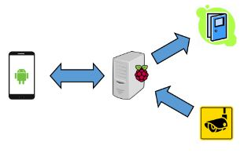

# Gatekeeper-Flask
This project is an IoT based application with the aim of controlling a door strike and camera with an Android smartphone. 
The Flask server runns on Raspbian which on turn runs on a Raspberry Pi.

## Architecture

## Door strike
The doorstrike is connected to a GPIO pin which activates if a signal is send to the server by the smartphone app.

## Camera
The camera can be turned on by clicking the nessary button in the app, the server will then start streaming the video feed to the smartphone.

You can find the client side application under: [Gatekeeper-Android](https://github.com/RidSib/Gatekeeper-Android)

